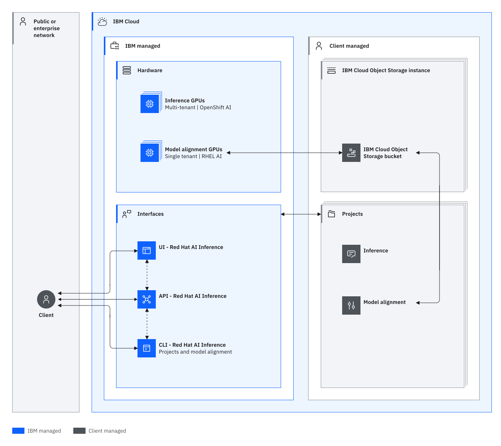

---

copyright:
  years: 2025, 2026
lastupdated: "2026-05-12"

keywords: instructlab, workload isolation, architecture, data, tenants

subcollection: inference

---

{{site.data.keyword.attribute-definition-list}}

# Learning about {{site.data.keyword.short_name}} architecture and workload isolation
{: #compute-isolation}

{{site.data.keyword.instructlab_full_notm}} operates on a Software-as-a-Service (SaaS) model, ensuring that operations run on dedicated GPU machines. After completion, all data is securely wiped, guaranteeing complete isolation between tenant workloads.
{: shortdesc}

By understanding the following architectural principles and isolation levels, you can select the solution that best aligns with your workload requirements. Our commitment to data isolation and security is unwavering, ensuring that your operations are conducted in a safe, controlled, and independent environment.

## {{site.data.keyword.instructlab_short}} architecture
{: #architecture}

{{site.data.keyword.instructlab_short}} is a comprehensive, cloud-based service designed for inferencing, data generation, and model alignment tasks. The architecture is built on a Software-as-a-Service (SaaS) model, which inherently provides a high level of isolation between tenant workloads. Inferencing operations run on multi-tenanted Red Had OpenShift clusters running the Red Hat OpenShift AI operator on GPUs against stateless foundation models, while model alignment operations (including data generation and fine-tuning) are executed on dedicated single-tenant Red Hat Enterprise Linux machines running on GPUs. This architecture ensures that model alignment workloads have dedicated resource allocation with no shared physical or logical resources, preventing any potential data leakage or interference.

After an operation completes, all data is meticulously wiped from the system. This practice not only adheres to stringent data privacy standards but also ensures that no residual data from one tenant's workload can impact another. This rigorous data sanitization process, which is coupled with our SaaS-based architecture, provides a robust isolation mechanism, making {{site.data.keyword.instructlab_short}} an ideal choice for running sensitive workloads in the cloud.

Review the following sample architecture for {{site.data.keyword.instructlab_full_notm}}.  

{: caption="Architecture and data isolation diagram" caption-side="bottom"}{: external download="architecture-data-isolation-light.svg"}

### Storage
{: #arch-data}

Your {{site.data.keyword.instructlab_short}} artifacts, logs, and results of fine-tuning a model are stored in your own {{site.data.keyword.cos_short}} bucket. For information on {{site.data.keyword.cos_short}}, see [What is {{site.data.keyword.cos_short}}?](/docs/cloud-object-storage?topic=cloud-object-storage-about-cloud-object-storage). 

Inferencing uses Open AI compatible APIs to show data. Model responses are stored, accessible, and deletable with IAM controls against the project. 

### Backend components
{: #arch-backend}

{{site.data.keyword.instructlab_short}} operates Red Hat Enterprise Linux AI GPU machines that are dedicated to you during the data generation and fine-tuning operations. {{site.data.keyword.redhat_openshift_notm}} AI using {{site.data.keyword.containerfull_notm}} with one or more GPU machines to run multi-tenant models that support inferencing. 

### Security and access control
{: #arch-access}

You have full control over the IAM policies that determine what actions can be executed in your account, and can implement IAM-controlled access to keep data separated within individual projects in your account. You can also implement IBM Cloud Monitoring with Activity Tracker to audit and track API requests. All API requests are authenticated by and authorized through IBM Cloud IAM. 

### Data flow
{: #arch-dataflow}

In {{site.data.keyword.instructlab_short}}, data flows differently depending on whether you're using the service to fine-tune a model or using pre-trained models for inferencing. 

The inferencing data flow is as follows: 
1. Inferencing uses Red Hat OpenShift AI on {{site.data.keyword.containerfull_notm}} to serve multi-tenanted, stateless models for inferencing operations like chat completions. 
2. Inferencing uses OpenAI compatible interfaces for chat completions for API responses in get, create, delete, and list operations. 

And the data flow for fine-tuning a model is as follows: 
1. Data generation and fine-tuning operations use dedicated Red Hat Enterprise Linux AI GPU machines.
2. Artifacts, logs, and results are uploaded to your {{site.data.keyword.cos_short}} bucket.
3. Data is then wiped from the machine, providing a clean run for later operations. 

## {{site.data.keyword.instructlab_short}} workload isolation
{: #workload-isolation}

{{site.data.keyword.instructlab_short}} operations, like data generation and fine-tuning, are executed on a dedicated Red Hat Enterprise Linux AI GPU machine so that no two tenants share physical or logical resources. After an operation is complete, all data is meticulously wiped from the system. This practice adheres to stringent data privacy standards, ensures that no residual data from one tenant's workload remains on the dedicated machine, and prevents any potential data leakage or interference. 

Inferencing models are stateless, but multi-tenanted. 
